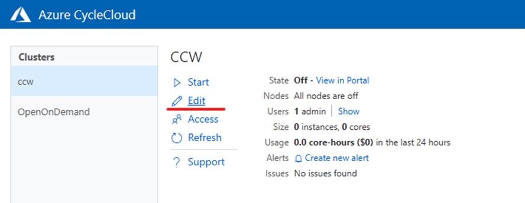
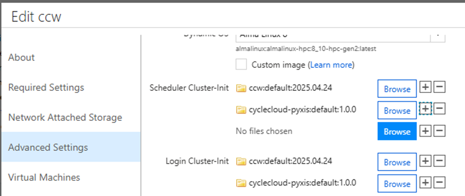
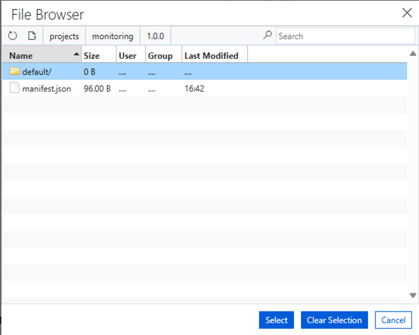
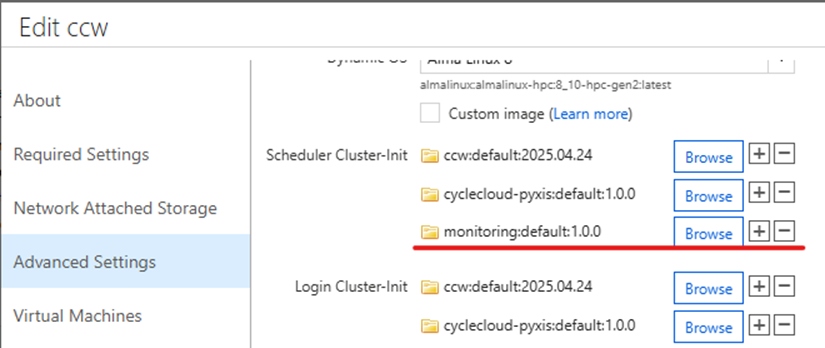
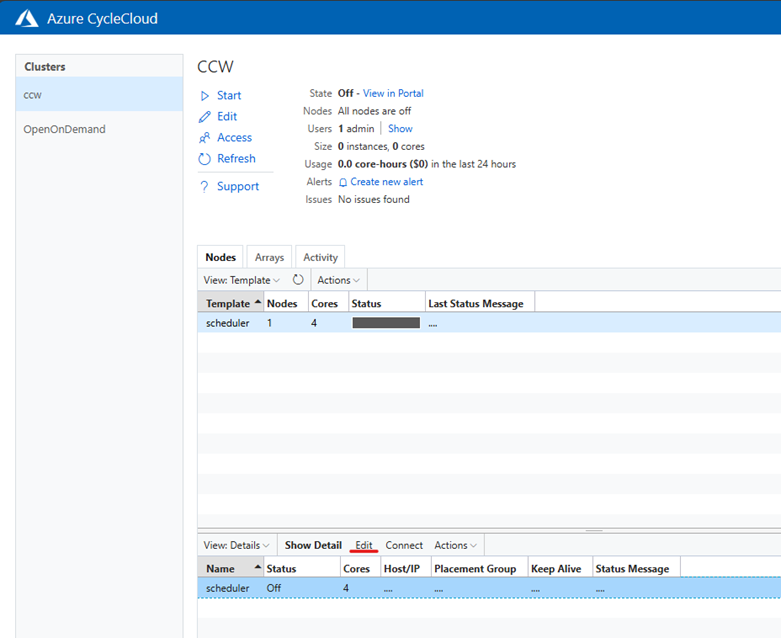
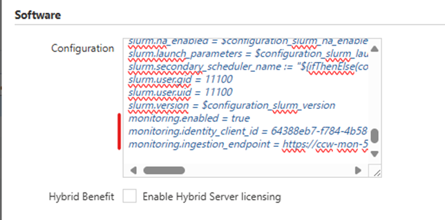

# Monitoring CycleCloud clusters with Prometheus and Grafana
This repository provides scripts and configuration files for monitoring Azure CycleCloud clusters with Prometheus and Grafana. The setup includes:
- Scripts to deploy a managed monitoring infrastructure on Azure using Azure Monitor Workspace for Prometheus, Azure Managed Grafana, and pre-defined dashboards.
- A CycleCloud cluster-init project to install and configure a self-hosted Prometheus instance on each cluster node and the scheduler.
- Installation and configuration of:
    - Prometheus Node Exporter (with Infiniband support)
    - NVidia DCGM exporter (for Nvidia GPU nodes)

## Build the Managed Monitoring Infrastructure
This repository includes a utility script that constructs the Managed Monitoring Infrastructure. These commands need to be run from a machine which can create azure resources, like a local laptop or a deployment agent. Don’t run these from the CycleCloud VM or from Cloud Shell.

Create a resource group where Managed Grafana and Azure Monitor Workspace for Prometheus will be created.
```bash
az group create -l <location> -n <resource_group>
```

Deploy the Managed Monitoring Infrastructure resources

```bash
git clone https://github.com/Azure/cyclecloud-monitoring.git
cd cyclecloud-monitoring
./infra/deploy.sh <monitoring_resource_group>
```

## Grant the Monitoring Metrics Publisher role to the User Assigned Managed Identity
A managed identity is required to publish metrics to the Azure Monitor Workspace for Prometheus. The `deploy.sh` script doesn't creates one and you would need to create one separately or use the one created by CycleCloud Workspace for Slurm (CCWS) if you are using it. 


If using CycleCloud Workspace for Slurm, you can grant the role `Monitoring Metrics Publisher` to the `ccwLockerManagedIdentity` created by the CCWS deployment, on the Data Collection Rule of the Managed Monitor Workspace. This will allow all machines provisioned by this CycleCloud environment to publish metrics.

```bash
./infra/add_publisher.sh <ccws_resource_group> ccwLockerManagedIdentity
```

If using your own Managed Identity, the same script can be used but with the corresponding resource group and Managed Identity name.


## Deploy the CycleCloud Cluster Init Project
Open a shell window on the cyclecloud VM.
Install git, clone the repo and upload the project into the CC locker

```bash
sudo su -
yum install -y git
cd <directory where you want to clone the repo>
git clone https://github.com/Azure/cyclecloud-monitoring.git
cd cyclecloud-monitoring
cyclecloud project upload azure-storage
```

Browse to the CycleCloud portal UI
Select the cluster to configure and edit the template



Then in the Advanced Settings tag, scroll down to display the cluster-init settings. For each setting, add a new one for monitoring. Click on the **+** button right to the last **Browse** button which will add a new row.



Click on the new Browse button, select the monitoring project, and browse inside the hierarchy until the default folder appears.



Select the `default` folder and click on the **Select** button. This will add the project to the cluster-init settings.



Then repeat for each Cluster-Init entry and click on the **Save** button at the bottom of the page to save the changes.

## Monitoring Configuration Parameters
The three monitoring parameters below need to be set for each node and node array definitions.
```yaml
cyclecloud.monitoring.enabled = true
cyclecloud.monitoring.identity_client_id = < Client ID of the Managed Identity with Monitoring Metrics Publisher role>
cyclecloud.monitoring.ingestion_endpoint = < The Azure Monitor Workspace in which to push metrics>
```

From the machine where you ran the managed infrastructure deployment, the value for `cyclecloud.monitoring.identity_client_id` can be retrieved by executing this command:

```bash
az identity show -n <umi_name> -g <umi_resource_group> --query 'clientId' -o tsv
```

If using CCWS, the value for the name will be `ccwLockerManagedIdentity` and the resource group will be the one created by CCWS.

The value for the `cyclecloud.monitoring.ingestion_endpoint` can be retrieved by running this command:
```bash
jq -r '.properties.outputs.ingestionEndpoint.value' <infra_monitoring_dir>/outputs.json
```

Then, browse to the CycleCloud portal UI and select the cluster to configure.
Select the Scheduler Node, and click on **Edit** to edit the scheduler node settings



In the Software/Configuration paste the content of the 3 parameters defined above.



Save and repeat for each node array and/or individual nodes in the cluster.
Once finished, you can start the cluster.

## How to check if metrics are published ?
You can verify that the started nodes are pushing metrics in the monitoring workspace by browsing the resource in the Azure portal. In the `Managed Prometheus / Prometheus explorer` menu from the left panel, using the `up` PromQL keyword, verify that configured nodes are listed.

To control the configured exporters are exposing metrics, connect to a node and execute these `curls` commands :
- For the Node Exporter : `curl -s http://localhost:9100/metrics` - available on all nodes
- For the DCGM Exporter : `curl -s http://localhost:9400/metrics` - only available on VM type with NVidia GPU

## Accessing the Monitoring Dashboards
Once the cluster is started, you can access the Grafana dashboards by browsing to the Azure Managed Grafana instance created by the deployment script. The URL can be retrieved by browsing the Endpoint of the Azure Managed Grafana instance in the Azure portal, and when connected, access the pre-built dashboards under the `Dashboards/Azure CycleCloud` folder.

