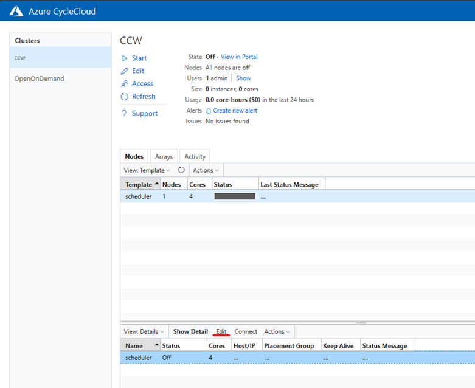
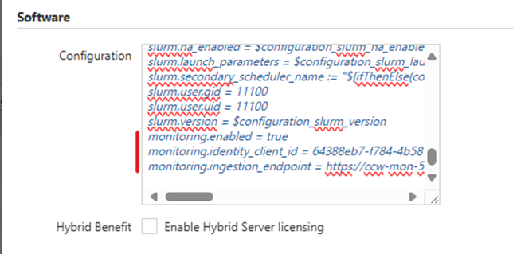

# Monitoring CycleCloud clusters with Prometheus and Grafana
This repository provides scripts and configuration files for monitoring Azure CycleCloud clusters with Prometheus and Grafana. The setup includes:
- Scripts to deploy a managed monitoring infrastructure on Azure using Azure Monitor Workspace for Prometheus, Azure Managed Grafana, and pre-defined dashboards.
- A CycleCloud cluster-init project to install and configure a self-hosted Prometheus instance on each cluster node and the scheduler.
- Installation and configuration of:
    - Prometheus Node Exporter (with Infiniband support)
    - NVidia DCGM exporter (for Nvidia GPU nodes)

**cyclecloud-slurm project 4.0.7+ also installs and configures the Azslurm-Exporter for scheduler nodes.**

## Build the Managed Monitoring Infrastructure
This repository includes a utility script that constructs the Managed Monitoring Infrastructure. These commands need to be run from a machine which can create azure resources, like a local laptop or a deployment agent. Don’t run these from the CycleCloud VM or from Cloud Shell.

Create a resource group where Managed Grafana and Azure Monitor Workspace for Prometheus will be created.
```bash
az group create -l <location> -n <resource_group>
```

Deploy the Managed Monitoring Infrastructure resources

```bash
git clone https://github.com/Azure/cyclecloud-monitoring.git
cd cyclecloud-monitoring
./infra/deploy.sh <monitoring_resource_group> [--user-object-id <object-id>]
```

Slurm users can optionally add `--slurm` to deploy the Slurm dashboards:

```bash
./infra/deploy.sh <monitoring_resource_group> --slurm [--user-object-id <object-id>]
```

### Optional: Configure MySQL During Deployment

Enable MySQL private endpoint networking and datasource configuration by adding `--mysql`, `--mysql-rg`, `--mysql-server`, and `--mysql-username` to the deployment command. The deployment creates and approves the private endpoint before configuring the datasource, and prompts securely for the MySQL password.

```bash
./infra/deploy.sh <monitoring_resource_group> \
  --mysql \
  --mysql-rg <mysql-resource-group> \
  --mysql-server <mysql-server-name> \
  --mysql-username <mysql-username>
```

Available MySQL flags:

- `--mysql`: Enable MySQL datasource configuration.
- `--mysql-rg <resource-group>`: MySQL Flexible Server resource group. Required with `--mysql`.
- `--mysql-server <name>`: MySQL Flexible Server resource name. Required with `--mysql`.
- `--mysql-username <user>`: MySQL username. Required with `--mysql`.
- `--mysql-database <name>`: Optional database name. Defaults to empty.
- `--mysql-port <port>`: Optional MySQL port. Defaults to `3306`.
- `--mysql-datasource-name <name>`: Optional Grafana datasource name. Defaults to the MySQL host.
- `--mysql-ca-cert-file <path>`: Optional CA certificate override. Without this flag, the deployment downloads the latest `azure-slurm-install-pkg-<version>.tar.gz` release asset and extracts `azure-slurm-install/AzureCA_<version>.pem`, then enables certificate validation.

For example:

```bash
./infra/deploy.sh my-monitoring-rg \
  --mysql \
  --mysql-rg my-mysql-rg \
  --mysql-server my-mysql-server \
  --mysql-username dbuser \
  --mysql-database mydb \
  --mysql-port 3306 \
  --mysql-datasource-name MySQL \
  --mysql-ca-cert-file /path/to/AzureCA_certificate
```

The optional `--slurm` flag can be combined with the MySQL options shown above to deploy the Slurm dashboards as part of the same deployment. The MySQL password is never accepted as a command-line argument; it is requested interactively at runtime.

The optional `--user-object-id` argument overrides the deployment identity used by the Bicep template. When omitted, the script uses the object ID of the signed-in Azure user.

### Configure MySQL for an Existing Grafana Workspace

To configure MySQL for an existing Azure Managed Grafana workspace, run the networking script first. It creates the managed private endpoint and approves the corresponding MySQL private endpoint connection. The Grafana and MySQL resources can be in different resource groups.

```bash
./infra/add_mysql_networking.sh \
  --grafana-rg <grafana-resource-group> \
  --grafana-name <grafana-workspace-name> \
  --mysql-rg <mysql-resource-group> \
  --mysql-server <mysql-server-name>
```

After networking succeeds, create the datasource. The MySQL password must be provided through stdin and is not exposed as a command-line argument:

```bash
read -r -s -p "Enter MySQL password: " MYSQL_PASSWORD
echo
printf '%s\n' "$MYSQL_PASSWORD" | ./infra/add_mysql_datasource.sh \
  --resource-group <grafana-resource-group> \
  --grafana-name <grafana-workspace-name> \
  --mysql-rg <mysql-resource-group> \
  --mysql-server <mysql-server-name> \
  --mysql-username <mysql-username> \
  --mysql-password-stdin \
  --mysql-ca-cert-file <path-to-AzureCA-certificate>
unset MYSQL_PASSWORD
```

Optional datasource arguments include `--datasource-name`, `--mysql-database`, and `--mysql-port`. The datasource script resolves the MySQL hostname from the Flexible Server resource. When `--mysql-ca-cert-file` is omitted, it downloads the latest `azure-slurm-install-pkg-<version>.tar.gz` asset from `Azure/cyclecloud-slurm` and extracts the embedded `azure-slurm-install/AzureCA_<version>.pem` certificate.

## Grant the Monitoring Metrics Publisher role to the User Assigned Managed Identity
A managed identity is required to publish metrics to the Azure Monitor Workspace for Prometheus. The `deploy.sh` script doesn't creates one and you would need to create one separately or use the one created by CycleCloud Workspace for Slurm (CCWS) if you are using it. 


If using CycleCloud Workspace for Slurm, you can grant the role `Monitoring Metrics Publisher` to the `ccwLockerManagedIdentity` created by the CCWS deployment, on the Data Collection Rule of the Managed Monitor Workspace. This will allow all machines provisioned by this CycleCloud environment to publish metrics.

```bash
./infra/add_publisher.sh <ccws_resource_group> ccwLockerManagedIdentity
```

If using your own Managed Identity, the same script can be used but with the corresponding resource group and Managed Identity name.


## Deploy the CycleCloud Cluster Init Project
In Cyclecloud 8.8 Slurm deployments, the cyclecloud-monitoring project will be included by default in slurm 4.0.3 templates. To deploy the monitoring project for all other cluster types, add this line to your templates after each nodearray configuration.
```
[[[cluster-init cyclecloud/monitoring:default]]]
```

## Monitoring Configuration Parameters
The three monitoring parameters below need to be set for each node and node array definitions.
```yaml
cyclecloud.monitoring.enabled = true
cyclecloud.monitoring.identity_client_id = < Client ID of the Managed Identity with Monitoring Metrics Publisher role>
cyclecloud.monitoring.ingestion_endpoint = < The Azure Monitor Workspace in which to push metrics>
```

From the machine where you ran the managed infrastructure deployment, the value for `cyclecloud.monitoring.identity_client_id` can be retrieved by executing this command:

```bash
az identity show -n <umi_name> -g <umi_resource_group> --query 'clientId' -o tsv
```

If using CCWS, the value for the name will be `ccwLockerManagedIdentity` and the resource group will be the one created by CCWS.

The value for the `cyclecloud.monitoring.ingestion_endpoint` can be retrieved by running this command:
```bash
jq -r '.properties.outputs.ingestionEndpoint.value' <infra_monitoring_dir>/outputs.json
```
**Note: These parameters can be set directly in the cluster creation UI Monitoring Tab for cyclecloud-slurm 4.0.3 clusters**

For all other cluster types, browse to the CycleCloud portal UI and select the cluster to configure.
Select the Scheduler Node, and click on **Edit** to edit the scheduler node settings



In the Software/Configuration paste the content of the 3 parameters defined above.



Save and repeat for each node array and/or individual nodes in the cluster.
Once finished, you can start the cluster.

## How to check if metrics are published ?
You can verify that the started nodes are pushing metrics in the monitoring workspace by browsing the resource in the Azure portal. In the `Managed Prometheus / Prometheus explorer` menu from the left panel, using the `up` PromQL keyword, verify that configured nodes are listed.

To control the configured exporters are exposing metrics, connect to a node and execute these `curls` commands :
- For the Node Exporter : `curl -s http://localhost:9100/metrics` - available on all nodes
- For the DCGM Exporter : `curl -s http://localhost:9400/metrics` - only available on VM type with NVidia GPU
- For the Azslurm-Exporter in cyclecloud-slurm 4.0.7+ clusters: `curl -s http://localhost:9101/metrics` - only available on Slurm Scheduler VM


## Accessing the Monitoring Dashboards
Once the cluster is started, you can access the Grafana dashboards by browsing to the Azure Managed Grafana instance created by the deployment script. The URL can be retrieved by browsing the Endpoint of the Azure Managed Grafana instance in the Azure portal, and when connected, access the pre-built dashboards under the `Dashboards/Azure CycleCloud` folder.

## Limitations
Azure Monitor Workspace has a default limit of 1M timeseries and 1M events per minute. Reaching this limit will imply throttling and a long tailing in ingestion. As it stands, the current exporters will reach these limits for ~125 Hbv4 nodes with 176 cores, ~154 NDv5 nodes with 96 cores, and ~285 NCv4 nodes with 48 cores. 

> Note : see the online documentation if you need to increase these limits: https://learn.microsoft.com/en-us/azure/azure-monitor/metrics/azure-monitor-workspace-monitor-ingest-limits?tabs=azure-portal#request-for-an-increase-in-ingestion-limits-preview 